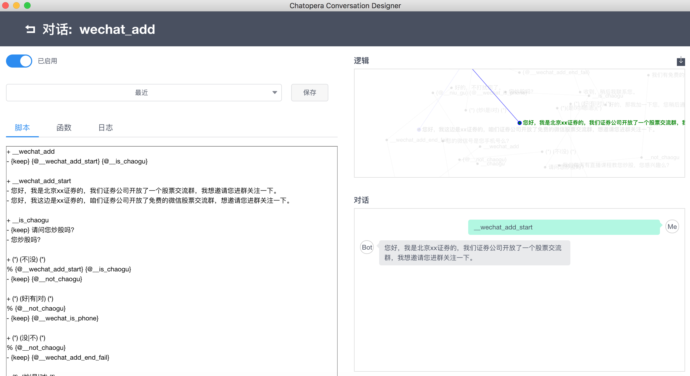

# 项目已归档 !!!

项目迁移合并，访问 [https://github.com/chatopera/chatbot-samples](https://github.com/chatopera/chatbot-samples) 获得更新。

# chatbot-sales

售前机器人

## 股票售前机器人

通过聊天机器人获取一个联系人是否有炒股需求，并征询意见加好友。



### 导入

1. 下载多轮对话设计器

```
https://docs.chatopera.com/conversation-designer.html
```

2. 下载**对话应用**

[小星.1.0.0.c66](https://github.com/chatopera/chatbot-sales/blob/master/金融证券/小星.1.0.0.c66)

3. 导入**多轮对话设计器**

[导入功能介绍见“快速开始”](https://docs.chatopera.com/conversation-designer.html)

## 更多

[文档](https://docs.chatopera.com/conversation-designer.html)
